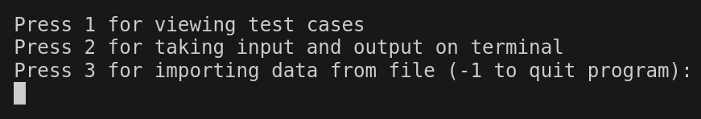
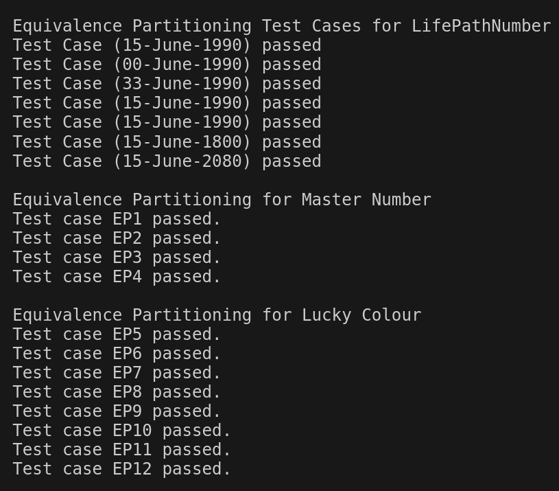
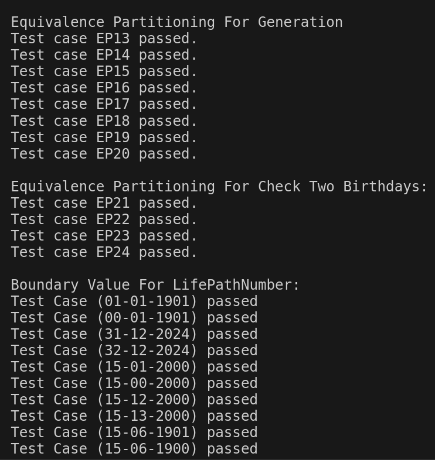
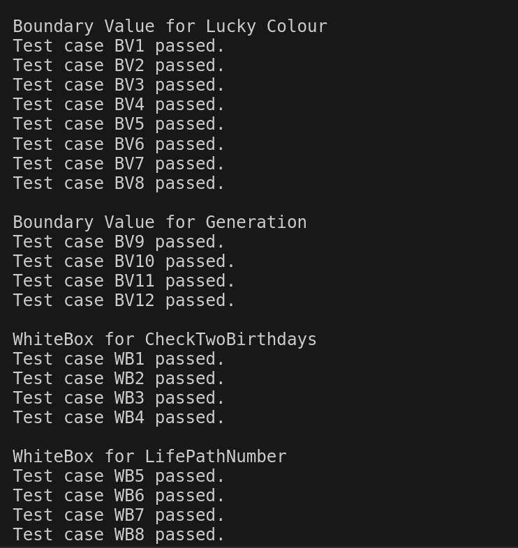
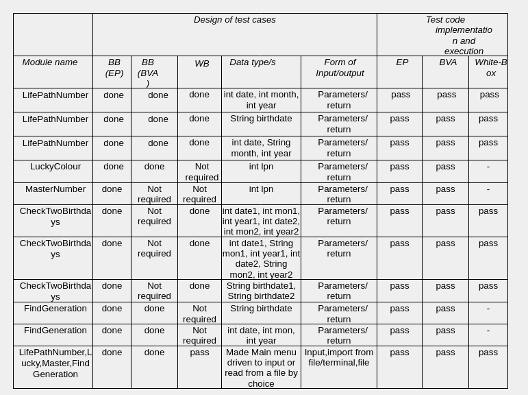
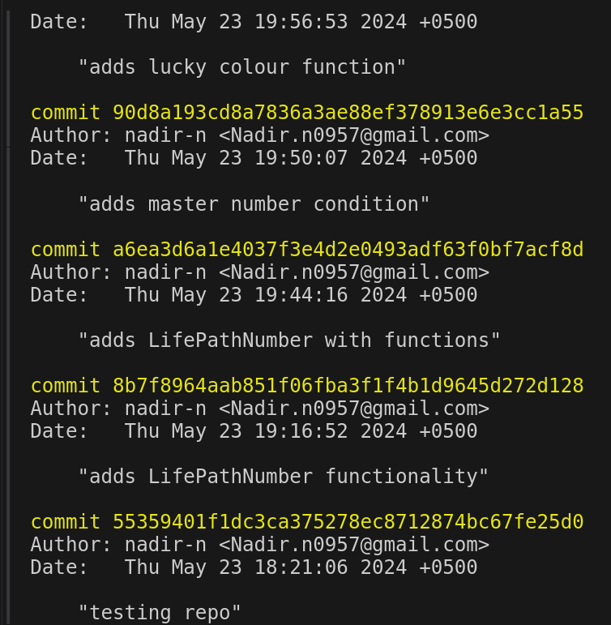
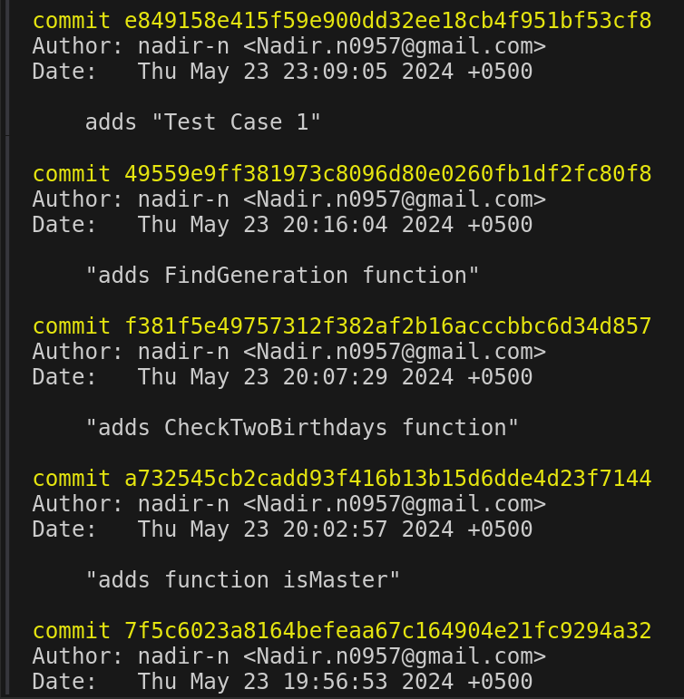
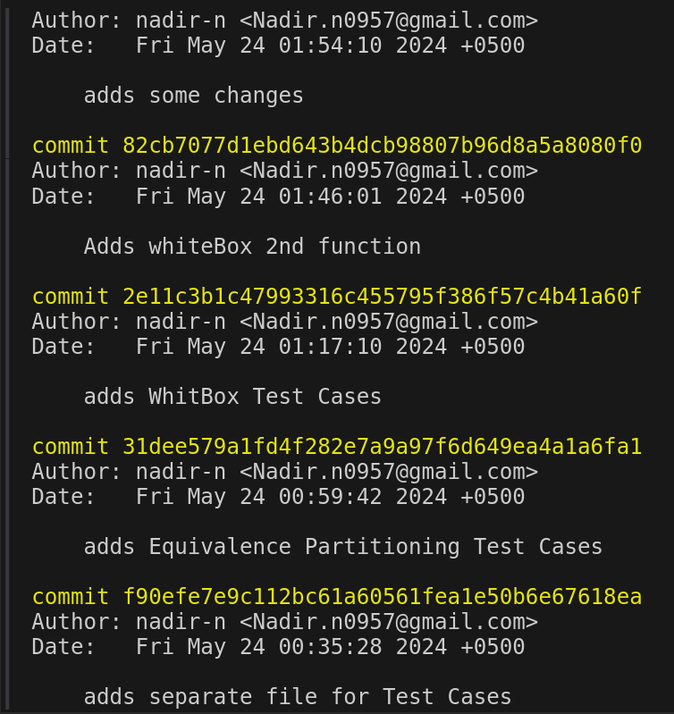
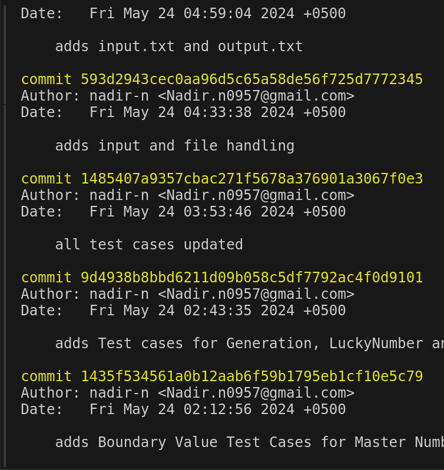
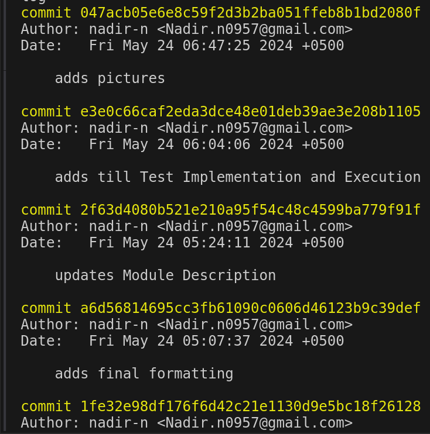

# Report

## Introduction

The software company aims to develop tools for numerology analysis, focusing on two scenarios:

For a given birthday, determine the Life Path Number, identify the Lucky Colour, and check if it's a master number. Also, compare Life Path Numbers if two birthdays are provided.

Determine the generation a person belongs to based on their birthday. Only birthdays between 1901 and 2024 are considered, accepting input in both numeric and month name formats.

## Module Descriptions

### public int CheckTwoBirthdays(int date1, int mon1, int year1, int date2, int mon2, int year2)

This method compares two birthdays and returns the Life Path Number of the person with the higher Life Path Number. If the Life Path Numbers are the same, it returns 1 otherwise it returns 0.

### public int CheckTwoBirthdays(int date1, String mon1, int year1, int date2, String mon2, int year2)

This method compares two birthdays same as previous function. Difference is only in function parameters. It is an overloaded function.

### public int CheckTwoBirthdays(String birthdate1, String birthdate2)

This method compares two birthdays same as previous function. Difference is only in function parameters. It is an overloaded function.

### public String FindGeneration(String birthdate)

This method determines the generation a person belongs to based on their birthday. It returns the generation name.

### public String FindGeneration(int date, int mon, int year)

This method determines the generation a person belongs to based on their birthday. It returns the generation name. It is an overloaded function.

### public boolean MasterNumber(int lpn)

This method checks if the Life Path Number is a master number. It returns true if it is a master number, otherwise it returns false.

### public String LuckyColour(int lpn)

This method returns the lucky colour based on the Life Path Number.

### public int LifePathNumber(int date, int month, int year)

This method calculates the Life Path Number based on the birthday. It returns the Life Path Number.

### public int LifePathNumber(String birthdate)

This method calculates the Life Path Number based on the birthday. It returns the Life Path Number. It is an overloaded function.

### public int LifePathNumber(int date, String month, int year)

This method calculates the Life Path Number based on the birthday. It returns the Life Path Number. It is an overloaded function.

### private int sumLPN(int num)

This method calculates the sum of the digits of the Life Path Number until it becomes one digit It returns the sum.

### private int Month(String mon)

This method converts the month name to a number. It returns the month number.

## Modularity

The program is divided into modules that perform specific tasks. Each module is responsible for a specific task, and the modules are designed to be reusable and interchangeable.

### Running Program

Run TestCases.java

_javac TestCases.java_

_java TestCases_

Now a menu driven interface will be shown. The programs asks whether you want to **Run the TestCases** or **enter input from user** and store it in result.txt or **read data from input.txt** already present in the same folder and display output on terminal.
If you want to run the test cases, press 1 and then press enter. If you want to enter input from user, press 2 and if you want to import from input.txt, press 3.
Press -1 to end the program.

If choice 2 or 3 is selected then the Life Path Number is calculated using functions defined above which are stored in a separate file named **LifePathCalculator**.
The Life Path Number is then used to calculate the Master Number and the Lucky Colour.

**input.txt contains last 4 digits of roll no as year**

## Black Box Test Cases
#### Testing Functions

EquivalencePartitioning_LifePathNumber(calculator);
EquivalencePartitioning_MasterNumber(calculator);
EquivalencePartitioning_LuckyColour(calculator);
EquivalencePartitioning_Generation(calculator);
EquivalencePartitioning_CheckTwoBirthdays(calculator);

BoundaryValue_LifePathNumber(calculator);
BoundaryValue_LuckyColour(calculator);
BoundaryValue_Generation(calculator);

## White Box Test Cases
The requirement was to use white box testing in any of the modules.
White-box testing involves testing internal structures or workings of an application.
### CheckTwoBirthdays(int date1, int mon1, int year1, int date2, int mon2, int year2)
#### Reason for Selection:

Multiple conditional checks
Involves calling another method (LifePathNumber)
Includes decision-making logic
### LifePathNumber(int date, int month, int year)
#### Reason for Selection:

Multiple conditional checks
Internal calculations involving other methods (e.g., sumLPN)
Key logic for calculating the life path number

#### Testing Functions
WhiteBoxForCheckTwoBirthdays(calculator);
WhiteBoxForLifePathNumber(calculator);

## Test implementation and test execution
The test cases were implemented in the file **TestCases.java** and were executed using the command **java TestCases**.

Press 1 to display test case results
All test cases are passed
Screenshots are attached below

## Traceability Matrix

## Version Control

## Discussion

